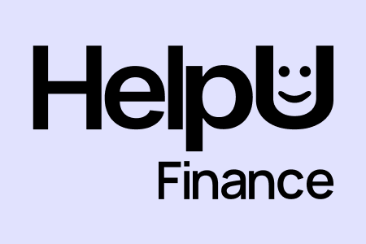
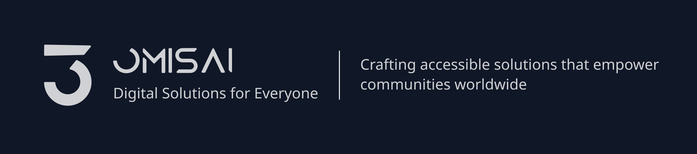

  

  
<strong>Empowering Financial Freedom for Everyone</strong>

  
  

## 🚀 Our Mission

We believe that **financial literacy should be accessible to everyone**. That's why we're building free, open access financial tools and educational resources to help people make better financial decisions.

## 📋 Contributing & Issues

While our main codebase is private, we welcome:

- 🐛 **Bug Reports** - Found something broken? Let us know!
- 💡 **Feature Requests** - Have an idea for a new tool or feature?
- 🎨 **UI/UX Feedback** - Help us improve the user experience
- 📝 **Content Suggestions** - Educational content ideas and improvements
- 🌐 **Translations** - Help us reach more people worldwide

**[Submit an Issue →](https://github.com/helpufinance/community/issues/new/choose)**

## 🌟 Features

### Current Tools
- **Loan Calculator** - Calculate payments, interest, and amortization schedules

### Coming Soon
- **Investment Guides** - Learn about different investment strategies
- **Personal Finance Basics** - Essential financial literacy content
- **Multi-Language Support**
- **Light & Dark Themes**
- **Educational Resources**

## 🤝 Get Involved

We're always looking for ways to improve and expand our impact:

1. **Use Our Tools** - Visit [helpu.finance](https://helpu.finance) and try our calculators
2. **Share Feedback** - Tell us what works and what doesn't
3. **Spread the Word** - Help others discover free financial tools
4. **Request Features** - What financial tool would help you most?

## 💖 Sponsor Us

Support our mission to make financial literacy accessible to everyone by sponsoring us through the [GitHub Sponsors program](https://github.com/sponsors/helpufinance). Your contributions help us build more tools, create educational content, and reach a wider audience.

## 📞 Connect With Us

- **Website**: [helpu.finance](https://helpu.finance)
- **Issues**: [Submit Here](https://github.com/helpufinance/community/issues)
- **Contact**: [Get in Touch](https://helpu.finance/contact)

---

  
<strong>Built with ❤️ by <a href="https://omisai.com">OMISAI</a></strong>

  
<em>Making financial empowerment accessible to everyone</em>

  

